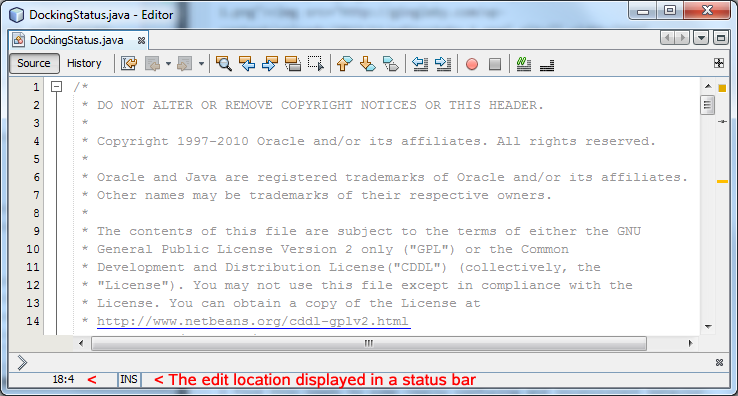

<!--

    Licensed to the Apache Software Foundation (ASF) under one
    or more contributor license agreements.  See the NOTICE file
    distributed with this work for additional information
    regarding copyright ownership.  The ASF licenses this file
    to you under the Apache License, Version 2.0 (the
    "License"); you may not use this file except in compliance
    with the License.  You may obtain a copy of the License at

      http://www.apache.org/licenses/LICENSE-2.0

    Unless required by applicable law or agreed to in writing,
    software distributed under the License is distributed on an
    "AS IS" BASIS, WITHOUT WARRANTIES OR CONDITIONS OF ANY
    KIND, either express or implied.  See the License for the
    specific language governing permissions and limitations
    under the License.

-->
#### This project is a Fork of the Apache NetBeans repo [apache/netbeans](https://github.com/apache/netbeans)
<details>
  <summary>Click to read: Original NetBeans ReadMe</summary>
        
# Apache NetBeans

Apache NetBeans is an open source development environment, tooling platform, and application framework.

### Build status
   * TravisCI:
     * [](https://travis-ci.org/apache/netbeans)
   * Apache Jenkins: 
     * Linux: [](https://builds.apache.org/view/M-R/view/NetBeans/job/netbeans-linux/)
     * Windows: [](https://builds.apache.org/view/M-R/view/NetBeans/job/netbeans-windows/)

### Requirements

  * Git
  * Ant 1.9.9 or above
  * Oracle JDK 8 or OpenJDK 8 (to build NetBeans)
  * Oracle JDK 9 or OpenJDK 9 (to run NetBeans)
  * MinGW (optional), to build Windows Launchers

**Note:** NetBeans also runs with JDK 8, although then it will not include tools for the JDK 9 Shell.

**Note:** NetBeans license violation checks are managed via the [rat-exclusions.txt](https://github.com/apache/netbeans/blob/master/nbbuild/rat-exclusions.txt) file.

### Building NetBeans

Build with the default config (See the [cluster.config](https://github.com/apache/netbeans/blob/ab66c7fdfdcbf0bde67b96ddb075c83451cdd1a6/nbbuild/cluster.properties#L19) property.)
```
$ ant
```
Build the basic project (mainly, JavaSE features):
```
$ ant -Dcluster.config=basic
```
Build the full project (including Groovy, PHP, JavaEE/JakartaEE, and JavaScript features):
```
$ ant -Dcluster.config=full
```
Build the NetBeans Platform:
```
$ ant -Dcluster.config=platform
```

**Note:** You can also use `php`, `enterprise`, etc. See the [cluster.properties](https://github.com/apache/netbeans/blob/master/nbbuild/cluster.properties) file.

#### Building Windows Launchers
Windows launchers can be build using [MinGW](http://www.mingw.org/) both on Windows and Linux.

As of [NETBEANS-1145](https://issues.apache.org/jira/browse/NETBEANS-1145), the Windows Launchers can be built adding ```do.build.windows.launchers=true``` property to the build process.
```
$ ant -Ddo.build.windows.launchers=true
```

##### Software Requirement to Build Windows Launchers on Ubuntu (16.04+):
```
sudo apt install make mingw-w64
```

### Running NetBeans

Run the build:
```
$ ant tryme
```

**Note:** Look in nbbuild/netbeans for the NetBeans installation created by the build process.

### Get In Touch

[Subscribe](mailto:users-subscribe@netbeans.apache.org) or [mail](mailto:users@netbeans.apache.org) the [users@netbeans.apache.org](mailto:users@netbeans.apache.org) list - Ask questions, find answers, and also help other users.

[Subscribe](mailto:dev-subscribe@netbeans.apache.org) or [mail](mailto:dev@netbeans.apache.org) the [dev@netbeans.apache.org](mailto:dev@netbeans.apache.org) list - Join development discussions, propose new ideas and connect with contributors.

### Download

Developer builds can be downloaded: https://builds.apache.org/job/netbeans-linux.

Convenience binary of released source artifacts: https://netbeans.apache.org/download/index.html.

### Reporting Bugs

Bugs should be reported to https://issues.apache.org/jira/projects/NETBEANS/issues/

### Full History

The origins of the code in this repository are older than its Apache existence.
As such significant part of the history (before the code was donated to Apache)
is kept in an independent repository. To fully understand the code
you may want to merge the modern and ancient versions together:

```bash
$ git clone https://github.com/apache/netbeans.git
$ cd netbeans
$ git log platform/uihandler/arch.xml
```

This gives you just few log entries including the initial checkin and
change of the file headers to Apache. But then the magic comes:

```bash
$ git remote add emilian https://github.com/emilianbold/netbeans-releases.git
$ git fetch emilian # this takes a while, the history is huge!
$ git replace 6daa72c98 32042637 # the 1st donation
$ git replace 6035076ee 32042637 # the 2nd donation
```

When you search the log, or use the blame tool, the full history is available:

```bash
$ git log platform/uihandler/arch.xml
$ git blame platform/uihandler/arch.xml
```

Many thanks to Emilian Bold who converted the ancient history to his
[Git repository](https://github.com/emilianbold/netbeans-releases)
and made the magic possible!
</details>

**This is a work in progress the code is experimental and subject to frequent changes**
<hr>

# Apache NetBeans with WindowManager<sup>2</sup>
An enhanced window manager for Apache NetBeans that supports splitting secondary windows and more


## Background
The NetBeans WindowManager has a long history and it has changed considerably over the years.  Some of these changes have lead to behavior that is inconsistent/unexpected. 

<details>
  <summary>Click to read more about these inconsistencies</summary>
  <br>
    
In NetBeans a mode (usually visually represented by a Tabbed container) is a place between splitters in the main window.  Separate floating windows contain a single mode.
   
The IDE default layout comprises a main editor region that is always visible (for opening documents) surrounded by a number of ancilliary modes (known as View modes) as seen here:

<p align="center">
  
</p>

TopComponents can have a default mode where they are initially opened.

TopComponents can be "**floated**" by using the Float menu action or by dragging and dropping a TopComponent outside the main window.  When a TopComponent is **floated** a **Floating Window** is created.

TopComponents can be moved from one mode to another (changing their location on screen).  TopComponents in an Editor mode can be moved to a View mode and vice-versa TopComponents in a View mode can be moved into an Editor mode.

The current NetBeans Window Manager determines if a TopComponent is an **Editor** or a **View** based on the **mode** the TopComponent is docked into. [(see DevFaqWindowsMode)](http://wiki.netbeans.org/DevFaqWindowsMode)

Swing does not track z-order for windows (only components within windows).  The NetBeans WindowManager implementation contains a class called **ZOrderManager**. The javadoc for **ZOrderManager** states:
<pre>
 Holds and manages z-order of attached windows.
 
 Note, manager is NetBeans specific, not general. It automatically attaches
 main window and expects that all registered zOrder are always above this main
 window.
 
 Not thread safe, must be called from EQT.
</pre>

The features described above lead to the following inconsistent behaviors:

### Z-order

* When NetBeans is restarted it restores the previous state. Modes and Floating windows that were open when the application closed are reopened. However NetBeans does not persist the Z-Order information. The windows to open are returned in an un-ordered set. If you had overlapping windows they may overlap in a different order after a restart.

* Floating a TopComponent from an **Editor** mode results in a **Frame** based window that can be positioned behined the main window. **This breaks the API contract described in ZOrderManager**  

* NetBeans cannot correctly track the drop-location when a Frame based window is positioned below the main window.  As seen here: 

<p align="center">
  
</p>

**_The drop location should have been in the main window output mode below the main editor region and not in the floating window below the main window._**

It's also possible to have multiple drop-locations visible at the same time:  As seen here:

<p align="center">
  
</p>

**_Only one of these drop locations is valid!_**

### Tab Displays

* Tabs in **Editor** modes contain icons
* Tabs in **View** modes do not contain icons

This makes it hard for a user to identify a TopComponent that is used for editing a document once the TopComponent is moved out of an **Editor** mode and into a **View** mode.

### Floating Window Creation

* **Floating** a TopComponent located in an **Editor** mode would create a **Frame** based floating window.  A frame based window can be positioned above or below the main window and can be minimized or maximized.  

* **Floating** a TopComponent located in one of the surrounding **View** modes would create a **Dialog** based window.  A dialog window is always positioned above the main window and cannot be minimized or maximized.  

From a user perspective a TopComponent used for editing a document is always an editor regardless of the mode it is located in.  Floating one of these TopComponents can sometimes create a **Frame** and sometimes create a **Dialog**.  Due to the nature of mode splitting it's not always obvious which regions are **View** modes.

### Status Bar Visibility

* A **Frame** based window displays a status bar that can display the current edit location (cursor row/column).  
* A **Dialog** based window does not display a status bar.  

A TopComponent that is used for editing a document can be displayed in both **Frame** and **Dialog** windows.  The status bar visibility can therefore be inconsistent.

A document editor in a **Frame** based window:

<p align="center">
  
</p>

The same document editor (TopComponent) in a **Dialog** based window:

<p align="center">
  
</p>
</details>

## Project Goal

The goal of this project is to provide a replacement NetBeans Window Manager with enhanced, **consistent** functionality and to give developers using the **NetBeans Platform** a little more control over how their custom applications behave and look.

The new Window Manager should be backward compatible with the existing Window System API and config\Windows2Local\WindowManager.wswmgr configuration data.

Summary of New Features
* [Consistent TopComponent layout across all windows](#consistent-topcomponent-layout-across-all-windows)
* [Consistent window creation](#consistent-window-creation)
* [Consistent editor detection](#consistent-editor-detection)
* [Consistent tab icon visibility](#consistent-tab-icon-visibility)
* [Consistent Editor status bar visibility](#consistent-editor-status-bar-visibility)
* [Consistent Z-ordering](#consistent-zordering)
* [IconSelector](#iconselector)
* [EditorSelector](#editorselector)
* [NbWindowSelector](#nbwindowselector)

The following modules were modified:

* [platform/openide.windows](#platform-openidewindows)
* [platform/core.windows](#platform-corewindows)
* [platform/openide.text](#platform-openidetext)
* [platform/o.n.swing.tabcontrol](#platform-onswingtabcontrol)
* [ide/editor](#ide-editor)

### Building NetBeans With WindowManager<sup>2</sup>

Build with the default config (See the [cluster.config](https://github.com/apache/netbeans/blob/ab66c7fdfdcbf0bde67b96ddb075c83451cdd1a6/nbbuild/cluster.properties#L19) property.)
```
$ ant
```
Build the basic project (mainly, JavaSE features):
```
$ ant -Dcluster.config=basic
```
Build the full project (including Groovy, PHP, JavaEE/JakartaEE, and JavaScript features):
```
$ ant -Dcluster.config=full
```
Build the NetBeans Platform:
```
$ ant -Dcluster.config=platform
```

**Note:** You can also use `php`, `enterprise`, etc. See the [cluster.properties](https://github.com/apache/netbeans/blob/master/nbbuild/cluster.properties) file.

### Running NetBeans With WindowManager<sup>2</sup>

Run the build:
```
$ ant tryme
```

**Note:** Look in nbbuild/netbeans for the NetBeans installation created by the build process.

## Potential Problems (Disclaimer)

* This project has not been tested with the many plugins that modify WindowManager behavior
* This project has not been tested on many platforms 
    * Main development performed on a Windows based machine 
    * Some tests performed on a Mac/OsX
* This project has not been tested extensively with custom mode configurations, persistent vs non-persistent TopComponents, etc.
* This project has not been tested by many users
* This project has not been tested for performance problems
* This project has not been tested for memory leaks

## Reporting Bugs

Issues should be reported here: https://github.com/GIngleby16/netbeans/issues

# What's New

### Consistent TopComponent layout across all windows

WindowManager<sup>2</sup> allow users to layout TopComponents (Editors & Views) in complex arrangements in secondary (aka Floating) windows.  Secondary/Floating windows can have Sliding modes.
<br>
<p align="center">
  
</p>

**_Note the image above shows TopComponents arranged in a Floating window (not the main window)_**

### Consistent Window Creation

WindowManager<sup>2</sup> will create **Dialog** based windows that stay visible above the main window for _all_ TopComponents dropped outside the main window.

This behavior can be altered using [NbWindowSelector](#nbwindowselector).  A simple setting change can instruct WindowManager<sup>2</sup>'s DefaultNbWindowSelector to create **Frame** based windows for **Editors** and **Dialog** based windows for **Views**.

### Consistent Editor detection

WindowManager<sup>2</sup> will use [EditorSelector](#editorselector) to determine if a TopComponent is an editor.  The result will be consistent regardless of the location or **mode** a TopComponent is docked into.

### Consistent Tab Icon Visibility

WindowManager<sup>2</sup> **will always** display icons for **Editor** TopComponents and will **never** display icons for  **View** TopComponents.

<p align="center">
  
</p>

This behavior can be altered using [IconSelector](#iconselector).  A simple setting change can instruct WindowManager<sup>2</sup>'s DefaultIconSelector to **always** display icons for **both Editors & Views**.

### Consistent Editor Status Bar Visibility

WindowManager<sup>2</sup> will display editor status bars in both **Frame** and **Dialog** based windows _(if the window contains an Editor)_.

### Consistent Z-ordering

WindowManager<sup>2</sup> will correctly track **Frame** and **Dialog** based windows z-order.  When an application is relaunched the windows will be recreated (and thus overlap) in the same order they were when the application exited.

Tracking the correct z-order will also allow WindowManager<sup>2</sup> to correctly display the intended drop location.

### IconSelector 

IconSelector is a ServiceProvider interface that can be used to determine:
1. If an icon should be displayed in a Modes TabContainer
2. The Icon to be displayed.

The IconSelector Interface:  

```java
public interface IconSelector {
    /**
     * 
     * @param tc
     * @param wantedIcon
     * @return 
     */
    public Icon getIconForTopComponent(TopComponent tc, Icon wantedIcon);    
}
```

IconSelector implementations will be called _(in an undeterministic order)_.  The first non-null value returned will be rendered by the tab-control.  The icon the tab control would like to paint is passed in the wantedIcon parameter.  An IconSelector could return the icon as is, decorate it or replace it with something else.

The DefaultIconSelector implementation: 

```java
@ServiceProvider(service=IconSelector.class)
public class DefaultIconSelector implements IconSelector {

    @Override
    public Icon getIconForTopComponent(TopComponent tc, Icon wantedIcon) {
        if(wantedIcon == null)
            return null;
        
        boolean isEditor = WindowManagerImpl.getInstance().isEditor(tc);
        if(!isEditor)
            return null;
        
        return wantedIcon;
    }    
}
```
The DefaultIconSelector implementation only returns an Icon if the TopComponent is an Editor.

A TopComponent does not have a method for determining if it's an Editor or not.  NetBeans currently determines if a TopComponent is an Editor or a View based on the mode it was added to.  A TopComponent type can therefore change as the component is moved around. 

WindowManager<sup>2</sup> uses a new ServiceProvider interface to consistently determine if a TopComponent is an Editor<br>
[(see EditorSelector)](#editorselector).

<sup>Note:</sup><br>The argument **_netbeans.winsys.enhanced.tab-icons=true_** can be used to change the behavior of the DefaultIconSelector so that the requested icon is always used (Both Editors and Views will have icons)

### EditorSelector 

EditorSelector is a ServiceProvider interface that can be used to determine if a TopComponent is an Editor.  ServiceProvider implementations will be be called _(in an undeterministic order)_.  The first provider to return **true** will indicate the TopComponent is an Editor.

The EditorSelector interface:

```java
public interface EditorSelector {
    /**
     * 
     * @param tc
     * @return true if the supplied TopComponent is an Editor
     */
    public boolean isEditor(TopComponent tc);    
}
```

The DefaultEditorSelector implementation:

```java
@ServiceProvider(service=IconSelector.class)
public class DefaultIconSelector implements IconSelector {

    @Override
    public Icon getIconForTopComponent(TopComponent tc, Icon wantedIcon) {        
        if(wantedIcon == null)
            return null;
        
        if (Boolean.getBoolean("netbeans.winsys.enhanced.tab-icons")) {
            return wantedIcon;
        }
        
        boolean isEditor = WindowManagerImpl.getInstance().isEditor(tc);
        if(!isEditor)
            return null;
        
        return wantedIcon;
    }    
}
```

The default implementation will return **true** for any TopComponent that has an EditorCookie in its lookup.  NetBeans Platform developers can easily provide additional implementations for determing if a TopComponent is an Editor.

### NbWindowSelector

NbWindowSelector is a ServiceProvider interface that can be used to determine what type of window should be created when a TopComponent is dropped in free-space.  NbWindowSelector implementations will be called _(in an undeterministic order)_.  The first implementation that returns **true** will indicate a **Dialog** based window is required.

The NbWindowSelector interface:

```java
public interface NbWindowSelector {
    /**
     * Determine (based on TopComponent) if an NbWindow should be Frame or Dialog
     * 
     * @param tc
     * @return 
     */
    public Boolean isDialogRequested(TopComponent tc);    
}
```

The DefaultNbWindowSelector implementation:

```java
@ServiceProvider(service=NbWindowSelector.class)
public class DefaultNbWindowSelector implements NbWindowSelector {
    @Override
    public Boolean isDialogRequested(TopComponent tc) {
        if (Boolean.getBoolean("netbeans.winsys.enhanced.nbwindow-frames") == Boolean.FALSE) {
            // only create dialogs for non-editors
            boolean isEditor = WindowManagerImpl.getInstance().isEditorTopComponent(tc);
            return !isEditor;
        }
        // default behavior
        return true;
    }    
}
```

The default implementation will always create a **Dialog** based window.

<sup>Note:</sup><br>The argument **_netbeans.winsys.enhanced.nbWindow.nbwindow-frames=true** can be used to change the behavior to create a new **Frame** based window when dropping an **Editor**. A new **Dialog** based window will be created when dropping a **View** (non-editor).

### Platform openide.windows

This module was updated to enhance The Window Manager API with methods to support NbWindow.  

### Platform core.windows

The most significant updates were performed in this module to implement the WindowManager2 features.

### Platform o.n.swing.tabcontrol

This module was updated to support displaying icons for Editor Top Components in tab controls for view based modes.

### Platform openide.text

Added DefaultEditorSelector a default service provider implementation that would determine if a TopComponent is an editor if its lookup contains an Editor cookie.

### IDE editor

org.netbeans.modules.editor.impl.StatusLineFactories - this class was modified to  make sure editor status lines are made visible in Dialogs that implement NbWindow.

# Debugging

Some API methods have had their visibility changed to public (from protected or private).  These changes were performed to quickly integrate a debug window that provided visibility to model internal values.   When the API is more stable the visibility will be changed back.

In contrib/gingleby there is a NetBeansDND NetBeans Platform application.  It contains two modules (NetBeansDNDModule and WindowManagerSpy).   NetBeansDNDModule is a simple application with some test TopComponents (Editors and Views) that can be used to test the drag/drop capability.  

WindowManagerSpy displays a debug window that allows you to:

* Invoke the garbage collector
* View groups
* View DockingStatus (minimized, maximized, default status)
* View Modes:mode2Model mapping
* View ModesSubModel:editorSplitSubModel
* View ModesSubModel:modes mapping
* View ModesSubModel:sides mapping (sliding modes)
* View ModesSubModel:mode2NbWindow (map of mode to floating window)
* View TopComponentRegistry listener events
* View TopComponentRegistry content
* View ViewHierarchy (For each window/split root map)
* View WindowManager listener
* View z-order for all windows
